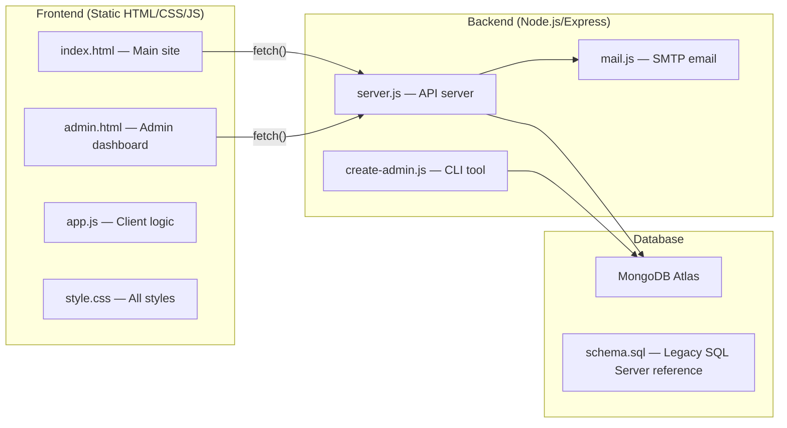
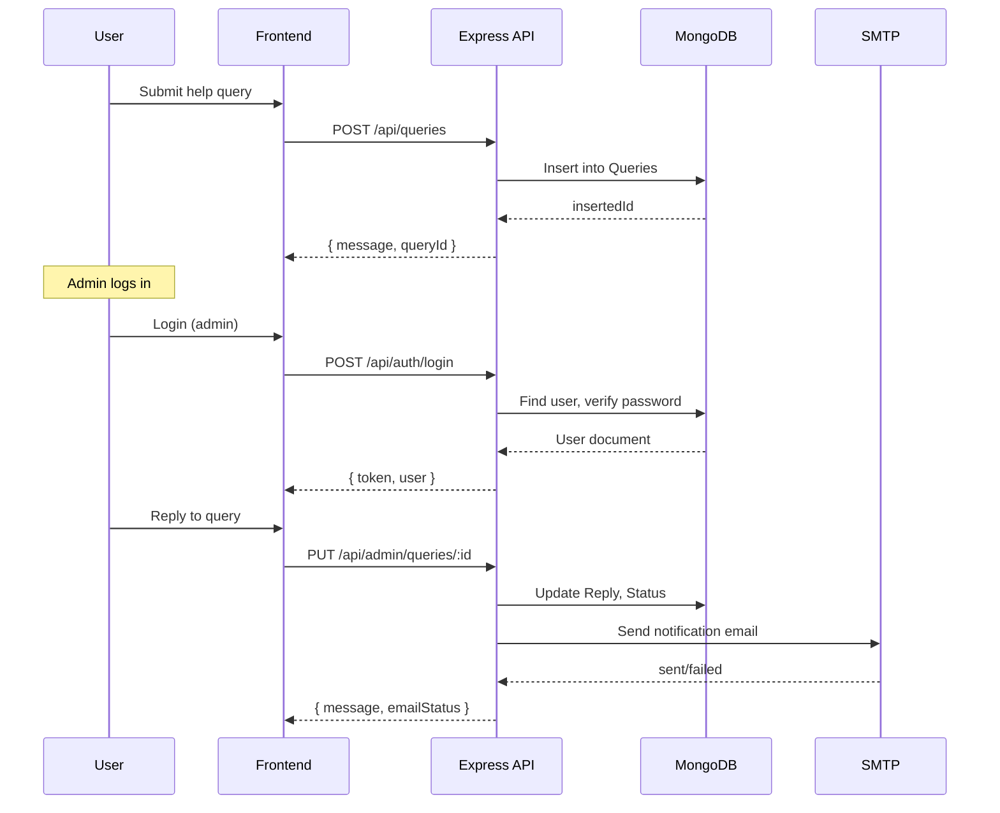

# EverLocker CEP — Full Codebase Analysis

## Project Overview

**EverLocker** is an educational **Community Engagement Project (CEP)** built by a 4-member IT student team. It trains users on Indian government digital services — **DigiLocker**, **Aadhaar**, and **PAN** — through learning content, FAQs, a help/query system, an interactive quiz, and an admin support dashboard.

> [!NOTE]
> This is explicitly a demo/educational project. The README repeatedly warns users never to enter real Aadhaar/PAN numbers, OTPs, or passwords.

---

## Architecture

| Layer | Tech | Hosting Model |
|-------|------|---------------|
| Frontend | Vanilla HTML + CSS + JS | Static host (Live Server / Netlify) |
| Backend | Node.js + Express | localhost:5000 / Render.com |
| Database | MongoDB Atlas | Cloud (Atlas) |
| Email | Nodemailer (SMTP) | Configurable |

---

## File-by-File Breakdown

### Frontend

| File | Size | Purpose |
|------|------|---------|
| [`index.html`](file:///d:/Mini%20repository/CEP/frontend/index.html) | 11.6 KB (197 lines) | Main single-page site: hero, services, issues, FAQ, help form, quiz |
| [`admin.html`](file:///d:/Mini%20repository/CEP/frontend/admin.html) | 20.9 KB (438 lines) | Admin support dashboard with auth gate, stats, inbox, reply system |
| [`app.js`](file:///d:/Mini%20repository/CEP/frontend/app.js) | 6.1 KB (127 lines) | Quiz engine, login/register modal, help query form submission |
| [`style.css`](file:///d:/Mini%20repository/CEP/frontend/style.css) | 19 KB (142 lines) | All styles for both pages (compressed single-line CSS) |
| [`admin/index.html`](file:///d:/Mini%20repository/CEP/frontend/admin/index.html) | 327 B | Simple redirect to `../admin.html` |

### Backend

| File | Size | Purpose |
|------|------|---------|
| [`server.js`](file:///d:/Mini%20repository/CEP/backend/server.js) | 9.1 KB (281 lines) | Express API: auth, queries CRUD, document upload, health check |
| [`mail.js`](file:///d:/Mini%20repository/CEP/backend/mail.js) | 1.1 KB (37 lines) | Nodemailer helper to send reply notification emails |
| [`create-admin.js`](file:///d:/Mini%20repository/CEP/backend/create-admin.js) | 1.5 KB (51 lines) | CLI script to create/update an admin user in MongoDB |
| [`package.json`](file:///d:/Mini%20repository/CEP/backend/package.json) | 456 B | Dependencies & scripts |
| [`.env.example`](file:///d:/Mini%20repository/CEP/backend/.env.example) | 176 B | Template for environment variables |

### Database

| File | Purpose |
|------|---------|
| [`schema.sql`](file:///d:/Mini%20repository/CEP/database/schema.sql) | Legacy SQL Server schema (not used by current backend) — includes `Users`, `Queries`, `Documents`, `FAQs`, `QuizQuestions` tables |

---

## API Endpoints

| Method | Route | Auth | Purpose |
|--------|-------|------|---------|
| `GET` | `/api/health` | None | Health check |
| `POST` | `/api/auth/register` | None | Register user (name, email, password) |
| `POST` | `/api/auth/login` | None | Login → JWT token |
| `POST` | `/api/queries` | None | Submit help query (public) |
| `GET` | `/api/admin/queries` | JWT + Admin | List all queries |
| `PUT` | `/api/admin/queries/:id` | JWT + Admin | Reply to a query + optional email notification |
| `POST` | `/api/documents` | None | Upload a demo document (multipart, 5MB limit) |
| `GET` | `/uploads/:filename` | None | Download a stored document |
| `GET` | `/api/admin/documents` | JWT + Admin | List all uploaded documents (metadata only) |

---

## MongoDB Collections

| Collection | Key Fields | Purpose |
|------------|-----------|---------|
| **Users** | `Name`, `Email` (unique index), `PasswordHash`, `Role`, `CreatedAt` | User accounts |
| **Queries** | `Name`, `Email`, `Category`, `Question`, `Reply`, `Status`, `CreatedAt`, `RepliedAt` | Help queries |
| **Documents** | `UserName`, `DocumentType`, `StoredFileName`, `OriginalFileName`, `ContentType`, `Content` (binary), `UploadedAt` | Demo file uploads |

---

## Key Features Implemented

### ✅ Authentication System
- JWT-based auth with 8-hour expiry
- bcrypt password hashing (10 rounds)
- Login/register modal on main site
- Separate login/register on admin page
- Admin role check middleware
- Default JWT secret `dev-secret` for development

### ✅ Help Query System
- Public submission form (no login required)
- Category selection: DigiLocker / Aadhaar / PAN / Other
- Admin reply with status update (Pending → Resolved)
- Optional email notification on reply via SMTP

### ✅ Admin Dashboard
- Auth gate (blocks non-admin users)
- Stats cards: total, pending, resolved counts
- Search/filter queries (all / needs reply / replied)
- Keyboard shortcut: `/` to focus search
- Reply textarea per query with save button
- Email status feedback after reply

### ✅ Quiz Game
- 5 hardcoded questions about DigiLocker/Aadhaar/PAN
- Option selection with visual feedback
- Score display at end
- Client-side only (no backend)

### ✅ Demo Document Upload
- Multipart file upload via `multer` (in-memory)
- 5MB limit
- File content stored as binary in MongoDB
- Download endpoint serves stored files

### ✅ Email Notifications
- Nodemailer with configurable SMTP
- Graceful fallback if SMTP not configured
- Email status reported back to admin

---

## Strengths

1. **Well-structured for a CEP project** — clear separation of frontend/backend/database
2. **Good security basics** — bcrypt hashing, JWT auth, admin middleware, email normalization
3. **Graceful error handling** — all API endpoints have try/catch, user-friendly error messages
4. **Clean admin dashboard** — polished UI with stats, search, filters, and responsive design
5. **Good documentation** — comprehensive README with step-by-step setup
6. **Deployed backend** — API base points to `cep-16gz.onrender.com` (Render hosting)
7. **Email notifications** — optional SMTP with proper fallback handling
8. **Admin CLI tool** — `create-admin.js` uses upsert, making it idempotent

---

## Issues & Improvement Opportunities

### 🔴 Security Concerns

| Issue | Location | Severity |
|-------|----------|----------|
| Hardcoded fallback JWT secret `"dev-secret"` | [`server.js:30`](file:///d:/Mini%20repository/CEP/backend/server.js#L30) | **High** — anyone can forge tokens in production |
| Document upload has **no authentication** | [`server.js:206`](file:///d:/Mini%20repository/CEP/backend/server.js#L206) | **High** — anyone can upload files |
| Document download has **no authentication** | [`server.js:228`](file:///d:/Mini%20repository/CEP/backend/server.js#L228) | **Medium** — anyone can download by filename |
| Query submission has **no rate limiting** | [`server.js:132`](file:///d:/Mini%20repository/CEP/backend/server.js#L132) | **Medium** — spam risk |
| `cors()` is wide open (allows all origins) | [`server.js:14`](file:///d:/Mini%20repository/CEP/backend/server.js#L14) | **Low** (acceptable for dev) |
| No input sanitization/XSS protection | Multiple files | **Medium** — `textContent` is used (safe), but no server-side sanitization |
| No password strength requirements | [`server.js:83`](file:///d:/Mini%20repository/CEP/backend/server.js#L83) | **Low** |

### 🟡 Code Quality

| Issue | Location | Impact |
|-------|----------|--------|
| Admin dashboard JS is **inline** in HTML (316 lines of `<script>`) | [`admin.html:118-435`](file:///d:/Mini%20repository/CEP/frontend/admin.html#L118-L435) | Hard to maintain, test, or lint |
| CSS is highly compressed (single-line blocks) | [`style.css`](file:///d:/Mini%20repository/CEP/frontend/style.css) | Hard to read and modify |
| Quiz data is **hardcoded** in frontend JS | [`app.js:3-9`](file:///d:/Mini%20repository/CEP/frontend/app.js#L3-L9) | Can't update without redeploying frontend |
| `API_BASE` hardcoded to Render URL | [`app.js:1`](file:///d:/Mini%20repository/CEP/frontend/app.js#L1) | Works but fragile — relies on `localStorage` override |
| Duplicate auth mode logic between `app.js` and `admin.html` | Both files | Code repetition |
| No `.env` validation library (e.g., `joi`, `zod`) | Backend | Missing env vars only caught at runtime |

### 🟡 Architecture

| Issue | Impact |
|-------|--------|
| No API versioning (`/api/v1/...`) | Future-proofing |
| Single-file server — no route/controller separation | Scalability |
| No request logging/monitoring | Debugging in production |
| `schema.sql` is orphaned — MongoDB is the actual DB | Confusion for new contributors |
| No automated tests | Regression risk |
| No CI/CD pipeline (`.github` exists but appears empty) | Manual deployments |

### 🟢 Nice-to-Haves (Listed in PROJECT_PLAN.md)

- Forgot-password flow
- FAQ admin management
- Tutorial video embeds
- Document metadata page
- Audit logging
- Stronger validation

---

## Dependency Summary

| Package | Version | Purpose |
|---------|---------|---------|
| `express` | ^4.21.1 | HTTP server |
| `mongodb` | ^6.21.0 | MongoDB driver |
| `bcryptjs` | ^2.4.3 | Password hashing |
| `jsonwebtoken` | ^9.0.2 | JWT auth |
| `cors` | ^2.8.5 | CORS middleware |
| `dotenv` | ^16.4.5 | Environment variables |
| `multer` | ^1.4.5-lts.1 | File upload handling |
| `nodemailer` | ^7.0.10 | Email sending |

> [!TIP]
> All dependencies are reasonably recent. No known critical vulnerabilities at these versions.

---

## Data Flow Summary

---

## Lines of Code Summary

| Component | Files | Total Lines | Total Size |
|-----------|-------|-------------|------------|
| Frontend HTML | 3 | 648 | ~33 KB |
| Frontend JS | 1 | 127 | 6.1 KB |
| Frontend CSS | 1 | 142 | 19 KB |
| Backend JS | 3 | 369 | 11.7 KB |
| Database SQL | 1 | 68 | 2.9 KB |
| Config/Docs | 4 | ~180 | ~6.3 KB |
| **Total** | **13** | **~1,534** | **~79 KB** |

---

## Verdict

This is a **well-executed educational CEP project** that covers a realistic full-stack workflow (auth, CRUD, file upload, email, admin dashboard). The code is clean and well-documented for a student project. The main areas for improvement are:

1. **Security hardening** — especially the default JWT secret and unauthenticated upload/download endpoints
2. **Code organization** — extracting the inline admin JS, formatting the CSS, and splitting the backend into routes/controllers
3. **Testing & CI** — no tests or automated pipeline exist
4. **Legacy cleanup** — the `schema.sql` and `database/` folder could confuse contributors since MongoDB is the actual storage
